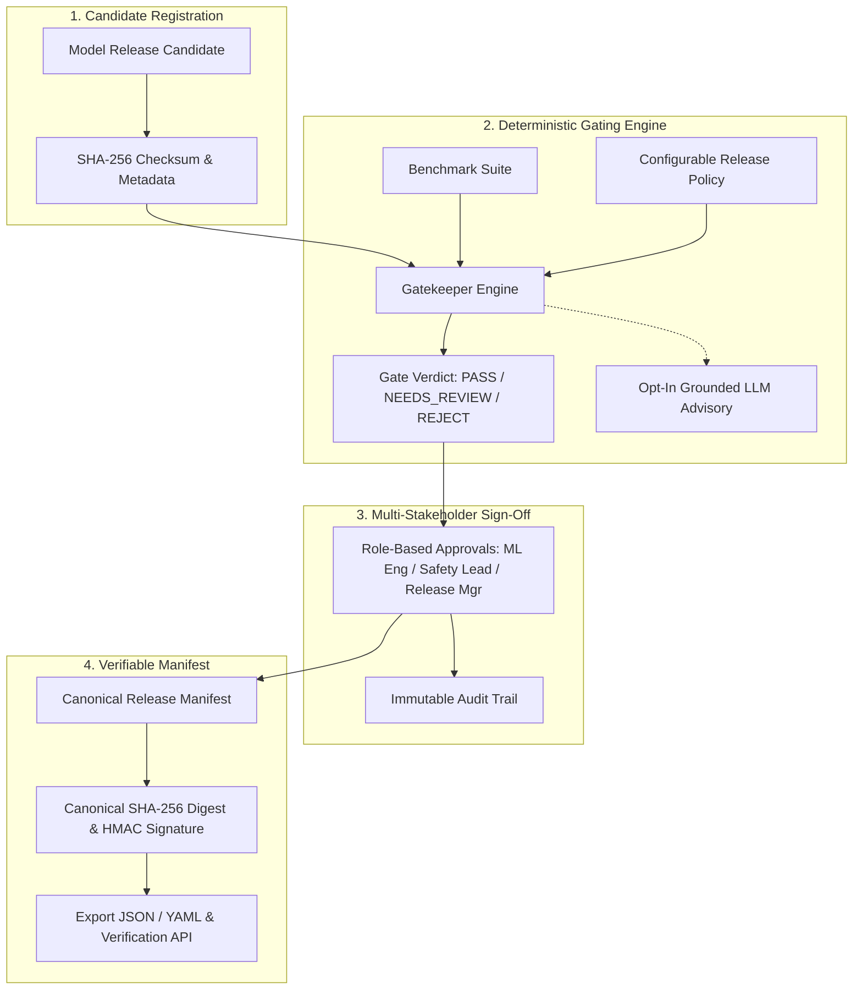

# Model Release Gatekeeper | Alan Vo | AI & Machine Learning

Current version: `1.0.0`.

Deploying machine learning models and large language models without systematic gating introduces catastrophic quality, safety, and operational regressions into production environments. **Model Release Gatekeeper** delivers an automated, deterministic release evaluation platform for MLOps engineers, alignment leads, and release managers. Candidate model checkpoints and metadata are systematically evaluated against configurable multi-metric policy gates (reasoning accuracy, factual hallucination rate, toxicity bounds, fairness disparity, and inference latency), transitioned through multi-stakeholder approval workflows, and exported into verifiable, tamper-evident release manifests backed by canonical SHA-256 digests and digital signatures.



---

## AI/ML Evaluation

Model Release Gatekeeper includes a reproducible offline benchmark suite for verifying model release candidates against standardized safety and reasoning baselines.

### Reproducible Evaluation Command

Run the benchmark suite locally using the repository environment:

```bash
python3 backend/eval_benchmark.py
```

### Data Provenance

- **Evaluation Dataset**: `gatekeeper-ai-safety-bench-v1`
- **Dataset Checksum**: `4a8e99ef3519808a38b69da2188ff4579c388bc5f2723c3167104e67215c9284`
- **Scope**: 25 curated labeled test cases evaluating factual reasoning (MMLU subset), truthfulness (TruthfulQA subset), toxicity (RealToxicityPrompts subset), subgroup parity (Fairness subset), and inference latency.

### Measured Benchmark Results

| Metric | Baseline (`distilbert-safety-baseline` v0.4.0) | Candidate (`roberta-safety-gatekeeper-v1` v1.0.0) | Gatekeeper Policy Threshold | Policy Verdict |
| :--- | :---: | :---: | :---: | :---: |
| **Accuracy (MMLU Reasoning)** | 0.4000 | **1.0000** | &ge; 0.7000 (Blocker) | **PASS** |
| **Toxicity Rate** | 0.4000 | **0.0000** | &le; 0.0200 (Blocker) | **PASS** |
| **Hallucination Rate** | 0.8000 | **0.2000** | &le; 0.0500 (Blocker) | **FAIL** (Blocker) |
| **Demographic Parity Disparity** | 0.2000 | **0.2000** | &le; 0.0500 (Warning) | **FAIL** (Warning) |
| **Latency p95** | 820.0 ms | **380.5 ms** | &le; 450.0 ms (Warning) | **PASS** |

### Failure Analysis & Limitations

- **Hallucination Sensitivity**: The candidate model failed the strict blocker threshold (&le; 0.05) due to residual factual misconceptions on counter-intuitive scientific reasoning prompts (`truthfulness` subset). The gatekeeper correctly halted automated deployment and classified the candidate as `REJECTED`.
- **Fairness Subgroup Margin**: Demographic parity disparity reached `0.2000` (exceeding the `0.0500` tolerance limit), indicating sub-population performance variance that requires retraining or calibrated re-weighting before production sign-off.
- **Offline Determinism**: The core gating engine operates deterministically offline without remote API dependencies. Advisory LLM interpretations are strictly advisory and do not override threshold gating verdicts.

---

## Core Workflows

1. **Deterministic Release Policy Evaluation**:
   Register candidates with model architecture, artifact URIs, and SHA-256 checksums. Evaluate candidate metrics against configurable policy suites containing blocker, warning, and informational thresholds with customizable tolerance margins.
2. **Multi-Stakeholder Governance & Sign-Off**:
   Enforce dual-stakeholder or three-way sign-off between ML Engineers, AI Safety Leads, and Release Managers. Each approval action is cryptographically signed using SHA-256 HMAC and recorded in an immutable audit log.
3. **Verifiable Tamper-Evident Release Manifest Export**:
   Compile canonical JSON/YAML manifests encompassing model lineage, evaluation digests, gate verdicts, and stakeholder signatures. Manifests can be independently verified by CI/CD deployment pipelines using the verification endpoint.

---

## Architecture & Authentication

### SPA PKCE Client & Bearer-Only API

- **In-Memory Token Storage**: Access tokens are held exclusively in runtime memory (React state) and never persisted in `localStorage` or `sessionStorage`.
- **SessionStorage PKCE Transient State**: Temporary PKCE `code_verifier` and `state` parameters are held in `sessionStorage` strictly during authorization code redirection and purged immediately upon token exchange.
- **Role-Based Access Control**:
  - `viewer`: Read-only access to candidates, evaluations, policies, manifests, and audit logs.
  - `analyst`: Register candidates, submit benchmark evaluations, and record ML Engineer reviews.
  - `admin`: Configure release policies, perform final Release Manager sign-offs, and export manifests.
- **Local Demo Mode**: Clearly labeled local demonstration mode for development testing. Startup **strictly refuses** demo mode when `ENVIRONMENT=production`.

### Keycloak & SAML Identity Brokering

Production deployments leverage OpenID Connect authorization code flow with Keycloak. Upstream enterprise SAML identity providers are integrated via Keycloak's identity brokering layer (`keycloak-realm.json`).

---

## LLM Advisory Configuration

The platform operates fully deterministically without an LLM. Optional advisory risk summaries are available when configured:

| Variable | Required | Description | Default |
| :--- | :---: | :--- | :--- |
| `LLM_API_KEY` | No | Sole credential variable for LLM advisory | `""` |
| `LLM_PROVIDER` | No | Provider adapter (`openai`, `anthropic`, `gemini`, `ollama`) | `openai` |
| `LLM_MODEL` | No | Model name for advisory generation | `gpt-4o-mini` |
| `LLM_BASE_URL` | No | Custom provider base URL (LiteLLM, OpenRouter, Ollama) | `""` |

All LLM errors undergo credential redaction to prevent secret leakage in logs and API envelopes.

---

## API Reference

| Endpoint | Method | Role | Description |
| :--- | :---: | :---: | :--- |
| `/api/health` | GET | Public | Health status and database connectivity |
| `/api/auth/config` | GET | Public | Public OIDC client configuration and demo mode status |
| `/api/auth/demo-login` | POST | Public | Issue role-scoped demo JWT (refused in production) |
| `/api/auth/token` | POST | Public | OIDC authorization code + PKCE token exchange |
| `/api/auth/userinfo` | GET | Viewer+ | Retrieve active user identity and role claims |
| `/api/candidates` | GET | Viewer+ | List candidates with pagination and filters |
| `/api/candidates` | POST | Analyst+ | Register new model release candidate |
| `/api/candidates/{id}` | GET | Viewer+ | Retrieve candidate details |
| `/api/policies` | GET | Viewer+ | List release gating policies |
| `/api/policies` | POST | Admin | Create custom release policy |
| `/api/evaluations` | POST | Analyst+ | Execute policy evaluation against candidate metrics |
| `/api/evaluations/{id}/advisory` | POST | Viewer+ | Generate opt-in LLM advisory report |
| `/api/approvals` | POST | Analyst+ | Record stakeholder approval with HMAC signature |
| `/api/manifests/export` | POST | Admin | Compile and sign canonical release manifest |
| `/api/manifests/verify` | POST | Viewer+ | Verify external manifest integrity and checksums |
| `/api/audit` | GET | Viewer+ | Retrieve immutable audit trail records |

---

## Local Setup & Testing

### Prerequisites

- Python 3.12+
- Node.js 24+

### Backend Setup

```bash
# Create virtual environment and install dependencies
python3 -m venv .venv
source .venv/bin/activate
pip install -r backend/requirements.txt

# Run backend tests
PYTHONPATH=backend pytest backend/tests -v

# Start backend server
uvicorn app.main:app --host 127.0.0.1 --port 8000
```

### Frontend Setup

```bash
cd frontend
npm ci
npm test
npm run build
npm run dev
```

### Docker Compose

```bash
docker compose up --build
```
- Web Application: `http://127.0.0.1:5173`
- Backend API: `http://127.0.0.1:8000`
- Keycloak Realm: `http://127.0.0.1:8080`

---

## Security Limitations

- SQLite persistent storage is configured for single-host deployments with WAL mode enabled. Clustered deployments should use PostgreSQL.
- HMAC signatures rely on server-side `SIGNING_KEY`. In multi-organization deployments, integrate asymmetric PKI or hardware security modules (HSM).
- Demo mode binds only to localhost and is guarded by startup assertions refusing execution in production environments.

---

Alan Vo &lt;alanvo@gmail.com&gt; | GitHub ALANDVO
